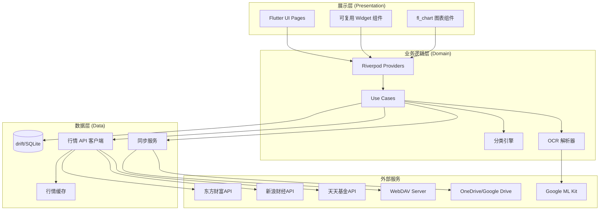
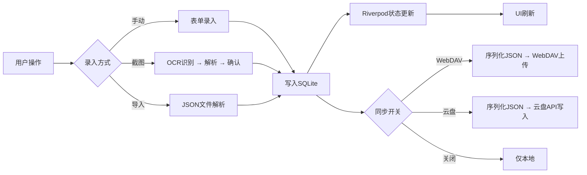

## 产品概述

家庭资产管理系统，一款支持 Mac/Web/Android/iOS 多端的 Flutter 应用，帮助家庭成员集中管理所有金融资产与负债，提供实时行情追踪、智能分类分析和可视化资产总览。数据存储在本地 SQLite，通过 WebDAV 或云盘 API 实现多端同步，无需后端服务，安装即用。

## 核心功能

### 1. 家庭成员与账户体系（无账号密码设计）

- **无登录系统**：不设计账号密码，应用启动后通过导入数据文件或配置云端文件链接来加载家庭数据，文件即授权
- **家庭名称**：每个家庭有唯一名称（如"张家"），与存储文件一一对应（如 `张家.json`），支持切换不同家庭数据源
- **启动流程**：

1. 导入已有家庭：选择本地文件/WebDAV/云盘链接 → 加载数据 → 确认家庭名称 → 选择角色 → 进入主界面
2. 新建家庭：输入家庭名称 → 添加成员信息 → 保存到本地 → 可选配置云端链接并上传备份
3. 游客体验：加载内置Demo数据，体验完整功能，顶部提示"演示模式"

- **角色选择**：加载家庭数据后，展示家庭成员列表，用户选择"我是谁"来切换当前身份。不同身份下仪表盘默认展示该成员视角的数据，同时可查看家庭全局视图
- 添加/编辑/删除家庭成员（姓名、头像、角色标签如户主/配偶/子女）
- 每个成员下管理多个证券账户（券商名称、账户类型）和银行账户（银行名称、活期/定期/理财）
- 每个账户下管理具体持仓（股票、基金、理财产品等）

### 2. 资产录入

- 手动录入：股票、基金、理财、房产等各类资产，填写名称、代码、数量、成本等
- OCR 截图识别录入：拍照或选择截图，本地 OCR 识别持仓数据，解析后用户确认再入库
- 定投计划截图识别：通过截图识别定投计划，自动生成后续投资日历
- 固定资产录入：房产（地址、面积、估值）、车辆等

### 3. 实时行情与涨跌展示

- 通过免费公开 API 获取 A 股、港股、美股行情及基金净值
- 本地缓存 + 定时刷新策略，展示每日涨跌幅和累计收益率
- 单个持仓和整体账户的盈亏情况

### 4. 资产分类汇总分析

- 自动分类引擎：根据持仓代码和名称自动识别归类
- 按市场：A 股、港股、美股
- 按品种：股票、ETF、QDII 基金、红利基金、纳指 ETF、债基、货币基金、理财、房产
- 支持用户自定义标签
- 分类汇总看板：各分类总资产、占比、收益的图表展示

### 5. 负债管理

- 录入各类负债：房贷、车贷、信用卡、借款等（金额、利率、期限、还款计划）
- 自动计算：净资产 = 总资产 - 总负债
- 资产负债表分类展示：现金类、投资类、固定资产类、负债类

### 6. 数据同步与导入导出

- 本地 SQLite 为主数据库
- WebDAV 同步（坚果云等）：配置服务器地址和凭证即可同步
- 云盘 API 同步（OneDrive / Google Drive）：OAuth 授权后直接读写云盘上的数据文件
- 支持 JSON 格式手动导入导出
- 支持切换不同数据源

### 7. 资产仪表盘首页

- 家庭总资产/净资产概览卡片
- 今日涨跌汇总
- 各成员资产分布
- 资产分类饼图和趋势折线图

## 技术栈选择

| 层面 | 技术选型 | 说明 |
| --- | --- | --- |
| 跨平台框架 | Flutter 3.x + Dart | 支持 Mac/Web/Android/iOS |
| 状态管理 | Riverpod 2.x | 类型安全、可测试、支持异步 |
| 本地数据库 | drift (SQLite ORM) | 类型安全的 SQLite 封装，支持所有平台 |
| 路由 | go_router | Flutter 官方推荐的声明式路由 |
| 网络请求 | dio | 强大的 HTTP 客户端，支持拦截器和缓存 |
| 图表 | fl_chart | 纯 Dart 实现的图表库，跨平台一致 |
| OCR 识别 | google_mlkit_text_recognition | Google ML Kit 本地文字识别 |
| 图片选择 | image_picker | 拍照/相册选择 |
| WebDAV | webdav_client | Dart WebDAV 客户端库 |
| OAuth | flutter_appauth | 标准 OAuth 2.0 流程支持 |
| 文件操作 | path_provider + file_picker | 本地文件路径和文件选择 |
| JSON序列化 | json_serializable + freezed | 代码生成，类型安全 |
| 依赖注入 | Riverpod（自带） | 与状态管理统一 |


## 实现方案

### 整体策略

采用 Clean Architecture 分层架构，将应用分为展示层(Presentation)、业务逻辑层(Domain)、数据层(Data) 三层。所有数据以本地 SQLite 为单一数据源(Single Source of Truth)，云端同步作为可选的数据备份通道。

### 关键技术决策

**1. 数据模型设计**

- 家庭(名称、创建时间、数据文件路径) → 成员 → 账户 → 持仓，四级层次关系
- 家庭名称与存储文件一一对应（如"张家" → `张家.json`）
- 内置演示Demo数据（`demo_family.json`），包含预设家庭、成员、账户和持仓样本
- 持仓通过 `asset_code` 和 `asset_type` 关联行情数据
- 资产分类使用标签系统，支持自动分类 + 手动标签
- 负债作为独立实体，关联到成员

**2. 行情数据获取策略**

- A 股/港股：东方财富公开 HTTP 接口，无需 API Key
- 美股：新浪财经海外接口
- 基金净值：天天基金公开接口
- 缓存策略：交易时段每5分钟刷新，非交易时段使用缓存，缓存 TTL 按市场交易时间动态调整
- 请求合并：批量查询接口，减少 HTTP 请求次数

**3. OCR 截图识别流程**

- 使用 Google ML Kit 进行本地文字识别（免费、离线、准确率较好）
- 识别后通过正则表达式 + 规则引擎解析券商持仓格式（适配主流券商截图格式）
- 解析结果展示给用户确认/修改后再入库
- Web 端 ML Kit 不可用时，降级使用 Tesseract.js via JS interop

**4. 云端同步方案**

- **WebDAV 模式**：将整库数据序列化为 JSON 文件上传/下载，使用时间戳版本控制，冲突时提示用户选择
- **云盘 API 模式**（OneDrive/Google Drive）：通过 OAuth 2.0 授权，将 JSON 数据文件存储在用户云盘指定目录
- **同步协议**：每次同步时对比本地和远端版本号，采用 last-write-wins + 用户确认策略处理冲突
- **数据格式**：统一的 JSON Schema，版本化，向后兼容

**5. 资产自动分类引擎**

- 基于持仓代码前缀和名称关键词的规则匹配
- 代码规则：6xxxxx.SH/SZ → A 股，0xxxx.HK → 港股，纳斯达克/NYSE → 美股
- 名称关键词：含"红利"→ 红利基金，含"债"→ 债基，含"货币"→ 货币基金，含"纳指/纳斯达克"→ 纳指 ETF，含"QDII"→ QDII 基金
- 分类结果可由用户修正，修正后记忆用户偏好

### 系统架构



### 数据流



## 实现注意事项

### 性能优化

- 行情数据批量请求，避免 N+1 问题；A 股支持批量查询接口一次获取多只股票
- SQLite 查询使用 drift 的响应式流（watchable queries），避免全量查询
- 图表数据在 Provider 层计算并缓存，避免 Widget rebuild 时重复计算
- 大量持仓数据使用 ListView.builder 懒加载

### 平台适配

- Web 端：drift 使用 sql.js（WASM），OCR 降级方案
- macOS 端：需要配置网络权限 entitlements
- 移动端：ML Kit 原生集成，SQLite 使用 sqlite3_flutter_libs

### 数据安全

- SQLite 数据库可选 SQLCipher 加密
- 云端同步的 JSON 文件可选 AES 加密后上传
- OAuth token 存储在平台安全存储（Keychain/Keystore）

### 错误处理

- 行情 API 请求失败时使用本地缓存数据，UI 标注数据时效
- 同步冲突时展示diff供用户选择
- OCR 识别失败时允许手动修正

## 目录结构

```
PersonalFinancialAssistant/
├── lib/
│   ├── main.dart                          # [NEW] 应用入口，初始化 ProviderScope、drift 数据库、路由配置
│   ├── app.dart                           # [NEW] MaterialApp 配置，主题、路由、全局错误处理
│   │
│   ├── core/                              # [NEW] 核心基础设施层
│   │   ├── constants/
│   │   │   ├── app_constants.dart         # [NEW] 应用常量：缓存TTL、API地址、资产类型枚举等
│   │   │   └── market_constants.dart      # [NEW] 市场相关常量：交易时间、市场代码前缀规则
│   │   ├── theme/
│   │   │   ├── app_theme.dart             # [NEW] 应用主题定义：亮色/暗色主题、颜色系统、字体系统
│   │   │   └── app_colors.dart            # [NEW] 颜色常量：涨跌色、分类色板
│   │   ├── router/
│   │   │   └── app_router.dart            # [NEW] go_router 路由配置：所有页面路由定义、底部导航Shell路由
│   │   ├── utils/
│   │   │   ├── format_utils.dart          # [NEW] 格式化工具：金额、百分比、日期格式化
│   │   │   ├── asset_classifier.dart      # [NEW] 资产自动分类引擎：基于代码前缀+名称关键词的规则匹配，返回分类标签
│   │   │   └── ocr_parser.dart            # [NEW] OCR文本解析器：正则规则解析券商持仓截图文本，提取股票代码/名称/数量/成本/市值
│   │   └── extensions/
│   │       └── string_extensions.dart     # [NEW] String 扩展方法
│   │
│   ├── data/                              # [NEW] 数据层
│   │   ├── database/
│   │   │   ├── app_database.dart          # [NEW] drift 数据库定义：所有表的声明、数据库版本迁移
│   │   │   ├── app_database.g.dart        # [NEW] drift 代码生成文件
│   │   │   ├── tables/
│   │   │   │   ├── family_members.dart    # [NEW] 家庭成员表：id, name, avatar, role, createdAt
│   │   │   │   ├── accounts.dart          # [NEW] 账户表：id, memberId, name, type(证券/银行), institution, subType
│   │   │   │   ├── holdings.dart          # [NEW] 持仓表：id, accountId, assetCode, assetName, assetType, quantity, costPrice, currentPrice, tags
│   │   │   │   ├── fixed_assets.dart      # [NEW] 固定资产表：id, memberId, type(房产/车辆), name, estimatedValue, details(JSON)
│   │   │   │   ├── liabilities.dart       # [NEW] 负债表：id, memberId, type, name, totalAmount, remainingAmount, interestRate, monthlyPayment
│   │   │   │   ├── investment_plans.dart  # [NEW] 定投计划表：id, accountId, assetCode, assetName, amount, frequency, nextDate
│   │   │   │   └── market_cache.dart      # [NEW] 行情缓存表：assetCode, price, change, changePercent, updatedAt
│   │   │   └── daos/
│   │   │       ├── member_dao.dart        # [NEW] 成员数据访问对象：CRUD + 按家庭查询
│   │   │       ├── account_dao.dart       # [NEW] 账户DAO：CRUD + 按成员查询 + 关联持仓查询
│   │   │       ├── holding_dao.dart       # [NEW] 持仓DAO：CRUD + 按账户/类型/标签查询 + 批量插入(OCR导入用)
│   │   │       ├── fixed_asset_dao.dart   # [NEW] 固定资产DAO
│   │   │       ├── liability_dao.dart     # [NEW] 负债DAO
│   │   │       └── market_cache_dao.dart  # [NEW] 行情缓存DAO：批量更新、按TTL过期查询
│   │   │
│   │   ├── models/                        # [NEW] 数据模型（freezed 不可变模型）
│   │   │   ├── family_member_model.dart   # [NEW] 成员模型 + JSON序列化
│   │   │   ├── account_model.dart         # [NEW] 账户模型，含账户类型枚举
│   │   │   ├── holding_model.dart         # [NEW] 持仓模型，含资产类型枚举、自动分类标签
│   │   │   ├── fixed_asset_model.dart     # [NEW] 固定资产模型
│   │   │   ├── liability_model.dart       # [NEW] 负债模型，含负债类型枚举
│   │   │   ├── investment_plan_model.dart # [NEW] 定投计划模型
│   │   │   ├── market_data_model.dart     # [NEW] 行情数据模型：价格、涨跌幅、成交量
│   │   │   ├── asset_summary_model.dart   # [NEW] 资产汇总模型：按分类聚合的总市值、占比、收益
│   │   │   └── sync_config_model.dart     # [NEW] 同步配置模型：WebDAV/云盘连接信息
│   │   │
│   │   ├── api/                           # [NEW] 行情API客户端
│   │   │   ├── market_api_client.dart     # [NEW] 统一行情API接口定义（抽象类）
│   │   │   ├── eastmoney_api.dart         # [NEW] 东方财富API实现：A股/港股行情批量查询
│   │   │   ├── sina_finance_api.dart      # [NEW] 新浪财经API实现：美股行情
│   │   │   └── fund_api.dart             # [NEW] 天天基金API实现：基金净值查询
│   │   │
│   │   └── sync/                          # [NEW] 数据同步层
│   │       ├── sync_service.dart          # [NEW] 同步服务抽象接口：upload/download/resolveConflict
│   │       ├── webdav_sync_service.dart   # [NEW] WebDAV同步实现：JSON序列化上传下载、版本号对比
│   │       ├── onedrive_sync_service.dart # [NEW] OneDrive同步实现：OAuth授权 + Graph API读写文件
│   │       ├── gdrive_sync_service.dart   # [NEW] Google Drive同步实现：OAuth授权 + Drive API读写文件
│   │       ├── sync_manager.dart          # [NEW] 同步管理器：调度同步任务、冲突处理策略、同步状态通知
│   │       └── data_serializer.dart       # [NEW] 数据序列化器：SQLite全量数据 ↔ JSON Schema（含版本号）
│   │
│   ├── providers/                         # [NEW] Riverpod 状态管理层
│   │   ├── database_provider.dart         # [NEW] 数据库实例Provider
│   │   ├── family_provider.dart           # [NEW] 家庭成员状态：成员列表、当前选中成员
│   │   ├── current_role_provider.dart     # [NEW] 当前角色状态：记录用户选择的身份角色，持久化到本地偏好
│   │   ├── account_provider.dart          # [NEW] 账户状态：账户列表、含持仓的账户详情
│   │   ├── holding_provider.dart          # [NEW] 持仓状态：持仓列表、批量操作
│   │   ├── market_provider.dart           # [NEW] 行情状态：实时行情数据、刷新控制、缓存管理
│   │   ├── asset_summary_provider.dart    # [NEW] 资产汇总状态：分类聚合计算、总资产/净资产
│   │   ├── liability_provider.dart        # [NEW] 负债状态
│   │   ├── sync_provider.dart             # [NEW] 同步状态：同步配置、同步进度、连接状态
│   │   └── ocr_provider.dart              # [NEW] OCR状态：识别进度、解析结果、确认流程
│   │
│   └── ui/                                # [NEW] 展示层
│       ├── shared/                        # [NEW] 共享UI组件
│       │   ├── widgets/
│       │   │   ├── asset_card.dart        # [NEW] 资产卡片组件：显示资产名称、市值、涨跌幅（带涨跌色）
│       │   │   ├── summary_card.dart      # [NEW] 汇总卡片：大数字+标签+趋势箭头
│       │   │   ├── member_avatar.dart     # [NEW] 成员头像组件
│       │   │   ├── empty_state.dart       # [NEW] 空状态占位组件
│       │   │   └── loading_overlay.dart   # [NEW] 加载遮罩组件
│       │   └── dialogs/
│       │       ├── confirm_dialog.dart    # [NEW] 确认对话框
│       │       └── sync_config_dialog.dart# [NEW] 同步配置对话框：WebDAV/云盘选择和配置
│       │
│       ├── welcome/                       # [NEW] 欢迎引导页
│       │   ├── welcome_page.dart          # [NEW] 欢迎页：导入家庭/新建家庭/游客体验 三个入口
│       │   ├── import_family_page.dart    # [NEW] 导入家庭页：选择导入方式(本地文件/WebDAV/云盘链接)并加载
│       │   ├── create_family_page.dart    # [NEW] 新建家庭页：输入家庭名称、添加成员、保存并可选上传云端
│       │   └── role_select_page.dart      # [NEW] 角色选择页：展示家庭名称+成员列表，选择"我是谁"
│       │
│       ├── dashboard/                     # [NEW] 仪表盘首页
│       │   ├── dashboard_page.dart        # [NEW] 仪表盘页面：总资产卡片、今日涨跌、成员分布、分类饼图
│       │   └── widgets/
│       │       ├── total_asset_card.dart   # [NEW] 总资产/净资产概览卡片，含今日涨跌
│       │       ├── member_asset_bar.dart   # [NEW] 各成员资产横向柱状图
│       │       ├── category_pie_chart.dart # [NEW] 资产分类饼图（fl_chart）
│       │       └── trend_line_chart.dart   # [NEW] 资产趋势折线图
│       │
│       ├── members/                       # [NEW] 家庭成员管理
│       │   ├── member_list_page.dart      # [NEW] 成员列表页：成员卡片列表，点击进入详情
│       │   ├── member_detail_page.dart    # [NEW] 成员详情页：该成员的所有账户和资产汇总
│       │   └── member_form_page.dart      # [NEW] 成员新增/编辑表单
│       │
│       ├── accounts/                      # [NEW] 账户管理
│       │   ├── account_list_page.dart     # [NEW] 账户列表页：按成员分组展示
│       │   ├── account_detail_page.dart   # [NEW] 账户详情页：持仓列表、账户汇总
│       │   └── account_form_page.dart     # [NEW] 账户新增/编辑表单
│       │
│       ├── holdings/                      # [NEW] 持仓管理
│       │   ├── holding_list_page.dart     # [NEW] 持仓列表页：支持按类型/市场筛选
│       │   ├── holding_form_page.dart     # [NEW] 持仓手动录入表单
│       │   └── ocr_import_page.dart       # [NEW] OCR截图导入页：拍照/选择 → 识别 → 预览确认 → 入库
│       │
│       ├── analysis/                      # [NEW] 分类分析
│       │   ├── analysis_page.dart         # [NEW] 分析总览页：分类维度选择、汇总图表
│       │   ├── widgets/
│       │   │   ├── category_summary_card.dart # [NEW] 分类汇总卡片：某一分类的总市值、持仓数、占比
│       │   │   └── category_detail_list.dart  # [NEW] 分类下的持仓明细列表
│       │   └── category_detail_page.dart  # [NEW] 单个分类详情页：该分类下所有持仓
│       │
│       ├── liabilities/                   # [NEW] 负债管理
│       │   ├── liability_list_page.dart   # [NEW] 负债列表页
│       │   ├── liability_form_page.dart   # [NEW] 负债录入/编辑表单
│       │   └── balance_sheet_page.dart    # [NEW] 资产负债表页：净资产=总资产-总负债，分类展示
│       │
│       └── settings/                      # [NEW] 设置
│           ├── settings_page.dart         # [NEW] 设置首页：同步配置、数据管理、关于
│           ├── sync_settings_page.dart    # [NEW] 同步设置页：WebDAV/云盘配置、连接测试、手动同步
│           └── data_manage_page.dart      # [NEW] 数据管理页：导入JSON、导出JSON、清空数据
│
├── test/                                  # [NEW] 测试目录
│   ├── core/
│   │   └── asset_classifier_test.dart     # [NEW] 资产分类引擎单元测试
│   ├── data/
│   │   └── api/
│   │       └── market_api_test.dart       # [NEW] 行情API测试
│   └── providers/
│       └── asset_summary_provider_test.dart # [NEW] 资产汇总计算逻辑测试
│
├── pubspec.yaml                           # [NEW] Flutter项目配置：所有依赖声明
├── analysis_options.yaml                  # [NEW] Dart 静态分析规则
├── README.md                              # [MODIFY] 更新项目说明文档
├── android/                               # [NEW] Android 平台配置（Flutter自动生成，需配置权限）
├── ios/                                   # [NEW] iOS 平台配置（Flutter自动生成，需配置权限和ML Kit）
├── macos/                                 # [NEW] macOS 平台配置（需配置网络和文件访问权限）
└── web/                                   # [NEW] Web 平台配置（需配置CORS和sql.js）
```

## 关键数据结构

```
// 核心枚举定义
enum AssetType {
  aStock,       // A股
  hkStock,      // 港股
  usStock,      // 美股
  indexETF,     // 指数ETF
  qdii,         // QDII基金
  dividendFund, // 红利基金
  bondFund,     // 债基
  moneyFund,    // 货币基金
  wealth,       // 银行理财
  deposit,      // 存款
  realEstate,   // 房产
  other,        // 其他
}

enum AccountType { securities, bank }
enum LiabilityType { mortgage, carLoan, creditCard, loan, other }
enum SyncType { none, webdav, onedrive, gdrive }

// 同步配置（freezed 不可变模型示例）
@freezed
class SyncConfig with _$SyncConfig {
  const factory SyncConfig({
    required SyncType type,
    String? serverUrl,       // WebDAV 地址
    String? username,        // WebDAV 用户名
    String? password,        // WebDAV 密码
    String? oauthToken,      // 云盘 OAuth token
    String? remotePath,      // 远端文件路径
    DateTime? lastSyncTime,
    int? remoteVersion,
  }) = _SyncConfig;
}
```

## 设计说明

本应用为 Flutter 原生开发，以下设计方案适用于 Flutter 的 Material Design 3 体系，作为 UI 设计规范指导 Flutter 实现。

## 设计风格

采用现代金融仪表盘风格，以深蓝色为主色调，搭配渐变卡片和微动效，营造专业、可信赖的资产管理氛围。整体设计简洁大气，信息层次清晰，关键数据突出显示。

## 页面设计

### 页面0：欢迎引导页 (Welcome / Onboarding)

- **首次启动展示**：应用Logo居中 + 简洁标语"家庭资产，一目了然"
- **三个操作入口**（大按钮卡片）：

1. 「导入已有家庭」— 点击后选择导入方式（本地JSON文件 / WebDAV配置 / 云盘文件链接），加载成功后显示家庭名称确认，然后进入角色选择
2. 「新建家庭」— 填写家庭名称（如"张家"）→ 添加家庭成员信息 → 保存到本地 → 可选配置云端链接并上传
3. 「游客体验」— 加载内置演示Demo数据（预设"示范家庭"，含2个成员、若干账户和持仓样本），体验完整功能，顶部banner提示"当前为演示模式"，可随时切换为正式家庭

- **角色选择页**：数据加载成功后，展示家庭名称 + 成员头像列表，用户点击选择"我是XXX"，之后进入主界面
- **后续切换**：在设置页或顶部导航可以随时切换当前身份角色，也可切换/导入不同家庭

### 页面1：仪表盘首页 (Dashboard)

- **顶部导航栏**：应用Logo + "家庭资产管理" 标题，左侧当前用户头像（点击可切换角色），右侧同步状态图标 + 设置齿轮图标
- **总资产概览卡片**：大面积渐变卡片（深蓝→靛蓝渐变），展示家庭总资产大数字、净资产、今日涨跌金额和百分比（涨红跌绿），带微光动效
- **成员资产分布**：水平滚动的成员头像卡片行，每个头像下方显示该成员总资产金额，点击切换筛选
- **资产分类饼图**：Material风格饼图，展示各分类资产占比，中心显示总金额，点击扇区查看详情
- **资产趋势折线图**：近30天资产变化趋势，渐变填充区域，支持手势缩放
- **底部导航栏**：5个Tab（首页/成员/账户/分析/设置），使用 NavigationBar Material3 组件

### 页面2：成员与账户管理

- **顶部导航栏**：返回箭头 + "家庭成员" 标题 + 右侧添加按钮
- **成员卡片列表**：每张卡片含头像(圆形)、姓名、角色标签(户主/配偶/子女)、该成员总资产金额、账户数量badge
- **账户展开区域**：点击成员卡片展开其下属账户列表，每个账户显示机构Logo、账户名、类型标签、总市值
- **悬浮操作按钮**：右下角FAB，点击弹出菜单（添加成员/添加账户）
- **底部导航栏**：同首页

### 页面3：持仓详情与OCR导入

- **顶部导航栏**：返回箭头 + 账户名称 + 右侧"截图导入"按钮
- **持仓列表**：每行显示持仓名称、代码、数量、成本价、现价、涨跌幅（涨红跌绿带背景色块）、市值，支持左滑编辑/删除
- **筛选标签栏**：横向滚动 Chip 标签（全部/股票/基金/理财/ETF），点击筛选
- **OCR导入弹出页**：底部弹出Sheet，顶部"拍照/相册"选择按钮，中间显示识别结果表格（可编辑修正），底部"确认导入"按钮
- **底部操作栏**：手动添加持仓按钮

### 页面4：分类分析

- **顶部导航栏**："资产分析" 标题 + 维度切换下拉（按市场/按类型/按标签）
- **汇总统计行**：横向滚动的统计小卡片（投资总额/今日收益/累计收益/年化收益率），渐变背景
- **分类列表**：每个分类一张卡片，含分类名称、彩色圆点标识、总市值、占比百分比+进度条、持仓数量、今日涨跌，点击展开查看该分类下的持仓明细
- **分类对比柱状图**：各分类资产金额的水平柱状图，支持排序
- **底部导航栏**：同首页

### 页面5：设置与数据管理

- **顶部导航栏**："设置" 标题
- **同步设置区块**：卡片样式，显示当前同步方式、连接状态（绿色已连接/灰色未配置），点击进入配置页面。配置页含 WebDAV/OneDrive/Google Drive 三个选项，选择后展示对应配置表单
- **数据管理区块**：导出数据JSON按钮、导入数据JSON按钮、清空所有数据按钮（带二次确认）
- **关于区块**：应用版本、开源协议
- **底部导航栏**：同首页

## Agent Extensions

### SubAgent

- **code-explorer**
- 用途：在开发过程中搜索 Flutter 依赖库的 API 用法和项目文件结构
- 预期结果：快速定位代码文件和依赖关系，辅助开发