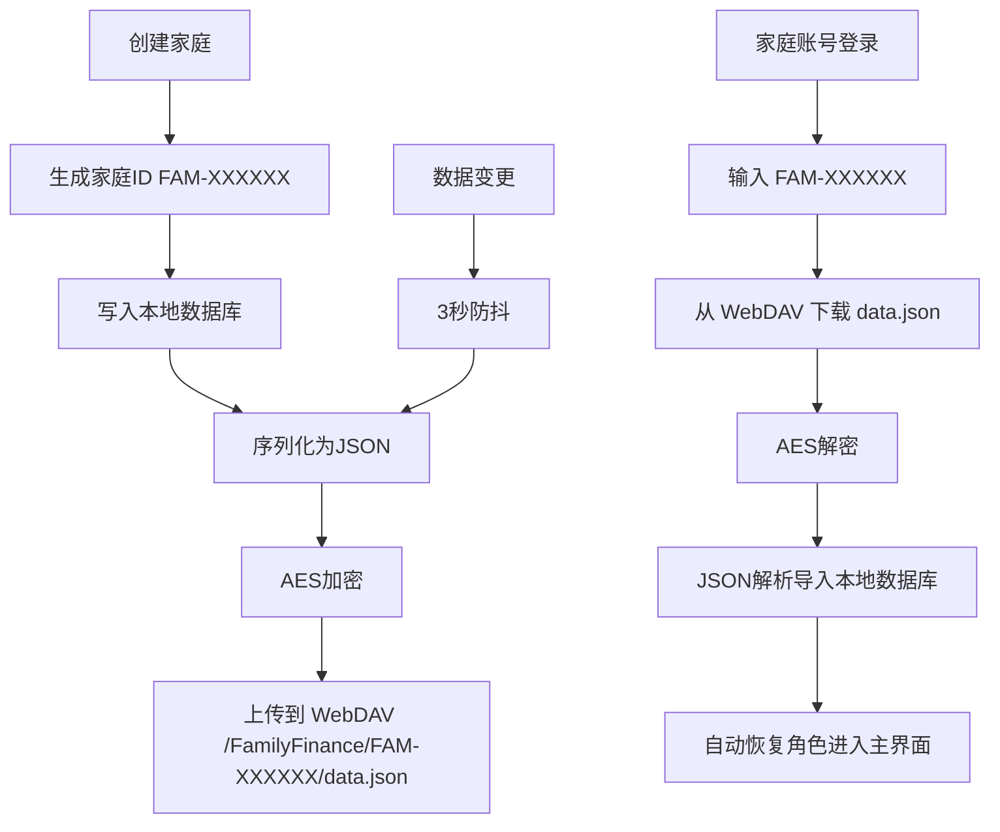

## 用户需求

将应用的家庭数据同步改为基于「家庭账号」体系，WebDAV 作为透明的公共存储后台，用户无感知。

## 核心功能

1. **创建家庭流程改造**：创建家庭时自动分配 6 位家庭账号（如 FAM-A3X9K2），在预设 WebDAV 上按家庭ID创建专属目录，加密上传数据，创建完成后展示家庭账号供用户记录
2. **登录流程改造**：去掉所有云端配置相关入口，登录方式改为两种 - 本地JSON文件导入（纯本地）、输入家庭账号ID从云端拉取数据并解密
3. **WebDAV 预设化**：删除 WebDAV 配置页面和所有用户可见的配置入口，WebDAV 连接信息（坚果云 `https://dav.jianguoyun.com/dav/`、账号 `luo.gz@qq.com`、密码 `a5fh7wv56g4mg6jc`）硬编码为应用内置后台
4. **数据加密存储**：上传到 WebDAV 的数据使用 AES 加密，以家庭ID为密钥因子，防止明文泄露
5. **自动同步**：数据变更后自动加密上传到对应家庭目录，其他设备用家庭账号登录即可获取最新数据
6. **账户表单优化**：账户名称、机构名称等输入框增加 hintText 示例文字，让用户更清楚应该输入什么
7. **设置页面精简**：移除「同步设置」入口，保留「数据管理」用于导入导出和手动同步

## 技术栈

- 框架：Flutter（已有项目，保持不变）
- 状态管理：flutter_riverpod
- 数据库：drift + drift_flutter
- 云存储：webdav_client（预设坚果云）
- 加密：encrypt 包（新增，用于 AES-256 加密数据）
- 路由：go_router

## 实现方案

### 核心架构变更

**1. 家庭账号体系**

创建家庭时生成 6 位唯一家庭 ID（格式 `FAM-XXXXXX`，其中 X 为大写字母+数字），持久化到 SharedPreferences 的 `family_id` key。该 ID 同时用作：

- WebDAV 远程目录路径：`/FamilyFinance/{familyId}/data.json`
- AES 加密密钥的派生因子

**2. 预设 WebDAV 配置**

在 `app_constants.dart` 中硬编码 WebDAV 连接信息，不再提供用户配置界面。`SyncConfigModel` 简化为只保存 familyId 和 lastSyncTime。`WebDavSyncService` 直接从常量获取连接信息。

**3. AES 加密方案**

使用 `encrypt` 包的 AES-CBC-256 加密：

- 密钥：对 `familyId + 固定盐值` 做 SHA-256 取前 32 字节作为 AES key
- IV：固定 16 字节（从 familyId hash 的后 16 字节取）
- 加密流程：JSON 字符串 → AES 加密 → Base64 编码 → 上传
- 解密流程：下载 → Base64 解码 → AES 解密 → JSON 解析

**4. 登录流程简化**

`login_family_page.dart` 重写为两种登录方式：

- 本地文件导入（纯本地，不触发任何上传）
- 家庭账号登录（输入 FAM-XXXXXX → 从 WebDAV 下载 → AES 解密 → 导入 → 自动恢复角色）

## 实现注意事项

- 加密密钥从 familyId 派生，确保同一 familyId 在不同设备上能正确解密
- WebDAV 目录创建需要逐级 mkdir（先创建 /FamilyFinance/，再创建 /FamilyFinance/{id}/）
- 家庭账号 ID 生成使用 UUID v4 截取 + 格式化，保证唯一性的同时便于用户记忆和输入
- 保留 familyId 持久化到 SharedPreferences，应用重启后自动同步不需要重新输入
- encrypt 包是纯 Dart 实现，全平台兼容（macOS/Web/Android/iOS）

## 架构设计

### 数据流



## 目录结构

```
lib/
├── core/
│   ├── constants/
│   │   └── app_constants.dart          # [MODIFY] 新增预设WebDAV常量、加密盐值；简化SyncType枚举
│   └── utils/
│       └── crypto_utils.dart           # [NEW] AES加密解密工具类，使用encrypt包实现AES-CBC-256
├── data/
│   ├── models/
│   │   └── sync_config_model.dart      # [MODIFY] 简化为只保存familyId和lastSyncTime
│   └── sync/
│       └── webdav_sync_service.dart    # [MODIFY] 使用预设配置连接WebDAV，按familyId分目录，加密上传/解密下载
├── providers/
│   ├── current_role_provider.dart      # [MODIFY] 新增familyIdProvider持久化到SharedPreferences
│   └── sync_provider.dart             # [MODIFY] 移除SyncConfigNotifier和用户配置逻辑，简化为预设WebDAV+familyId直接同步
├── ui/
│   ├── welcome/
│   │   ├── welcome_page.dart           # [MODIFY] 登录入口文案从"从本地文件或云端配置加载"改为"用家庭账号或本地文件登录"
│   │   ├── create_family_page.dart     # [MODIFY] 创建后生成familyId、加密上传云端、弹窗展示家庭账号
│   │   └── login_family_page.dart      # [MODIFY] 重写：去掉WebDAV配置入口，改为本地文件+家庭账号ID输入两种方式
│   ├── accounts/
│   │   └── account_form_page.dart      # [MODIFY] 所有输入框增加hintText示例（如"东方财富股票账户""华泰证券"等）
│   └── settings/
│       ├── settings_page.dart          # [MODIFY] 移除同步设置入口，新增显示当前家庭账号ID
│       ├── data_manage_page.dart       # [MODIFY] 同步逻辑改用预设配置和familyId，移除syncConfig依赖
│       └── sync_settings_page.dart     # [DELETE] 完全删除WebDAV配置页面
└── core/
    └── router/
        └── app_router.dart             # [MODIFY] 移除/sync-settings路由和对应import
```

## 关键代码结构

```
/// AES 加密工具（crypto_utils.dart）
class CryptoUtils {
  static const String _salt = 'FamilyFinance2024SecretSalt';
  
  /// 从 familyId 派生 AES-256 密钥
  static encrypt.Key deriveKey(String familyId);
  
  /// 从 familyId 派生 IV
  static encrypt.IV deriveIV(String familyId);
  
  /// 加密 JSON 字符串为 Base64
  static String encryptData(String plainText, String familyId);
  
  /// 解密 Base64 为 JSON 字符串
  static String decryptData(String encryptedBase64, String familyId);
}
```

```
/// 预设 WebDAV 常量（app_constants.dart）
static const String webdavUrl = 'https://dav.jianguoyun.com/dav/';
static const String webdavUser = 'luo.gz@qq.com';
static const String webdavPass = 'a5fh7wv56g4mg6jc';
static const String webdavBaseDir = '/FamilyFinance/';
```